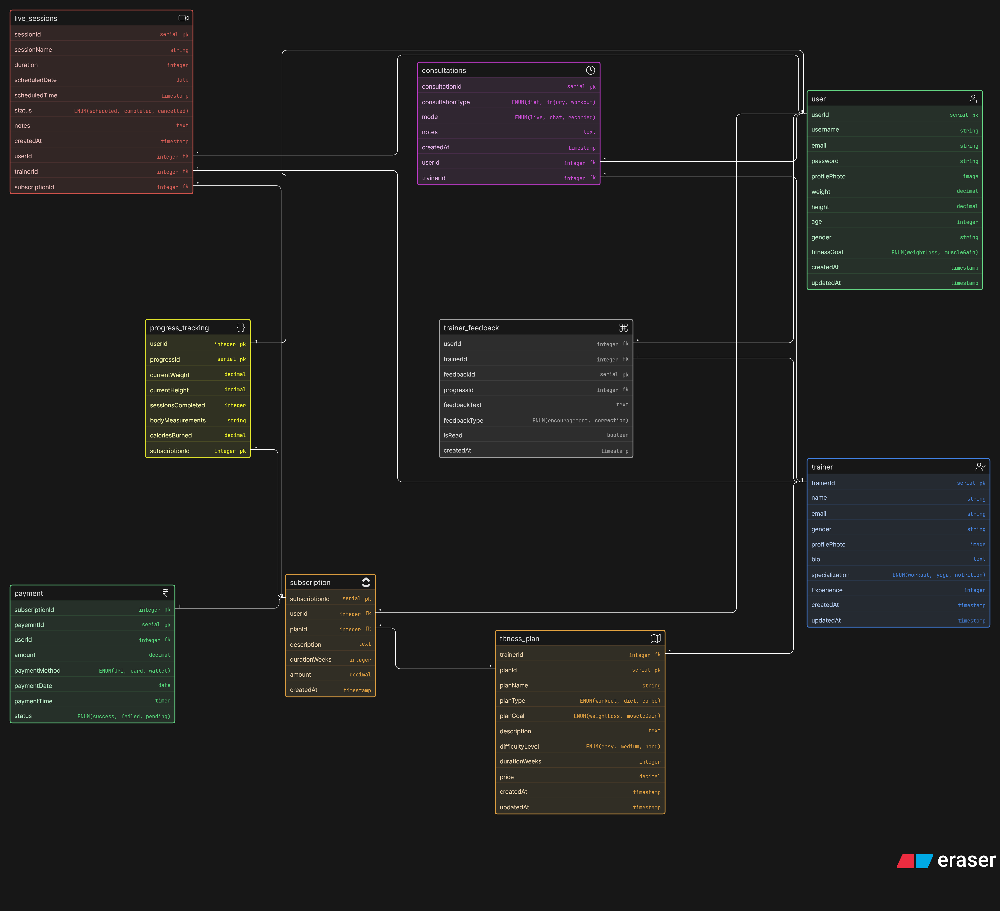

# Fitness Coaching Platform – Database Design

This repository contains the ER diagram for a fitness influencer coaching platform.

The goal was to design a scalable and practical database structure that models how an online coaching business operates.

---

## ER Diagram



---

## Problem Statement

A fitness influencer is building a platform to:

- Manage clients and trainers
- Offer fitness plans and subscriptions
- Schedule consultations and live sessions
- Track user progress (weight, measurements, check-ins)
- Handle payments and subscription lifecycle

---

## Core Entities

- **User (Client)**
- **Trainer**
- **Fitness Plan**
- **Subscription**
- **Consultations**
- **Live Sessions**
- **Progress Tracking**
- **Trainer Feedback**
- **Payment**

---

## Relationships Overview

- One trainer → multiple clients
- One client → multiple subscriptions
- One plan → multiple users
- One subscription → linked payments
- One user → multiple progress records
- Trainers interact with users via sessions and consultations

---

## Design Decisions

- Separated **progress tracking** from user data for better normalization
- Differentiated **consultations** and **live sessions**
- Used a **subscription model** to track plan lifecycle
- Stored **trainer feedback** independently for flexibility

---

## Key Learnings

- Translating real-world workflows into database structures
- Importance of normalization and separation of concerns
- Designing scalable schemas even for small systems
- Thinking in terms of relationships and system flow

---

## Status

This is a learning project (2nd database design attempt).  
Open to improvements and feedback.

---

## Project Structure

```
├── assets/
│ └── ER_Diagram.png
├── README.md
```

---

## Feedback

Suggestions and improvements are welcome.
Feel free to open an issue or connect with me.
